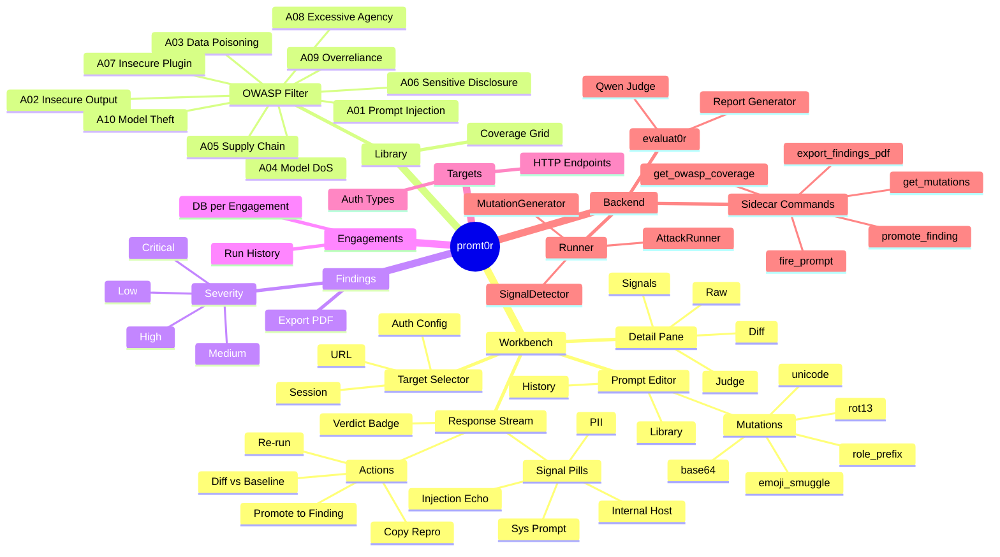

# promt0r Mind Map

```mermaid
mindmap
  root((promt0r))
    Workbench
      Target Selector
        URL
        Auth Config
        Session
      Prompt Editor
        Library
        Mutations
          base64
          rot13
          unicode
          role_prefix
          emoji_smuggle
        History
      Response Stream
        Verdict Badge
        Signal Pills
          PII
          Sys Prompt
          Internal Host
          Injection Echo
        Actions
          Promote to Finding
          Re-run
          Copy Repro
          Diff vs Baseline
      Detail Pane
        Diff
        Signals
        Raw
        Judge
    Library
      OWASP Filter
        A01 Prompt Injection
        A02 Insecure Output
        A03 Data Poisoning
        A04 Model DoS
        A05 Supply Chain
        A06 Sensitive Disclosure
        A07 Insecure Plugin
        A08 Excessive Agency
        A09 Overreliance
        A10 Model Theft
      Coverage Grid
    Findings
      Severity
        Critical
        High
        Medium
        Low
      Export PDF
    Engagements
      DB per Engagement
      Run History
    Targets
      HTTP Endpoints
      Auth Types
    Backend
      Sidecar Commands
        fire_prompt
        get_mutations
        get_owasp_coverage
        promote_finding
        export_findings_pdf
      Runner
        AttackRunner
        SignalDetector
        MutationGenerator
      evaluat0r
        Qwen Judge
        Report Generator
```
